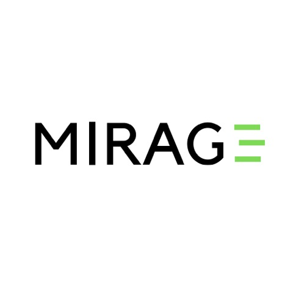

# MIRAGE
### MIDI Image Renderer and Audio Generation Engine

Created by Cameron Chiu, Joseph Rotella, Matthew Suh, and Zack Sussman

### Project Description

See here: https://docs.google.com/document/d/1vAp0hvIu12kRFYWOfsTkIwBrCRu7wVZqK4uBAhG6XOc/edit?usp=sharing

### Third-Party Modules

The following modules must be installed in order to run MIRAGE:

* midiutil
* numpy
* opencv-python
* colour-science

Additionally, you must install `fluid-synth` using Homebrew via `brew install fluid-synth`, then copy the file [here](https://drive.google.com/file/d/1UYE4C-W9gCHZJzUZZ-hR_GJBsO8BvcWF/view?usp=sharing) to `/usr/local/Cellar/fluid-synth/2.1.5/share/soundfonts/default.sf2`.